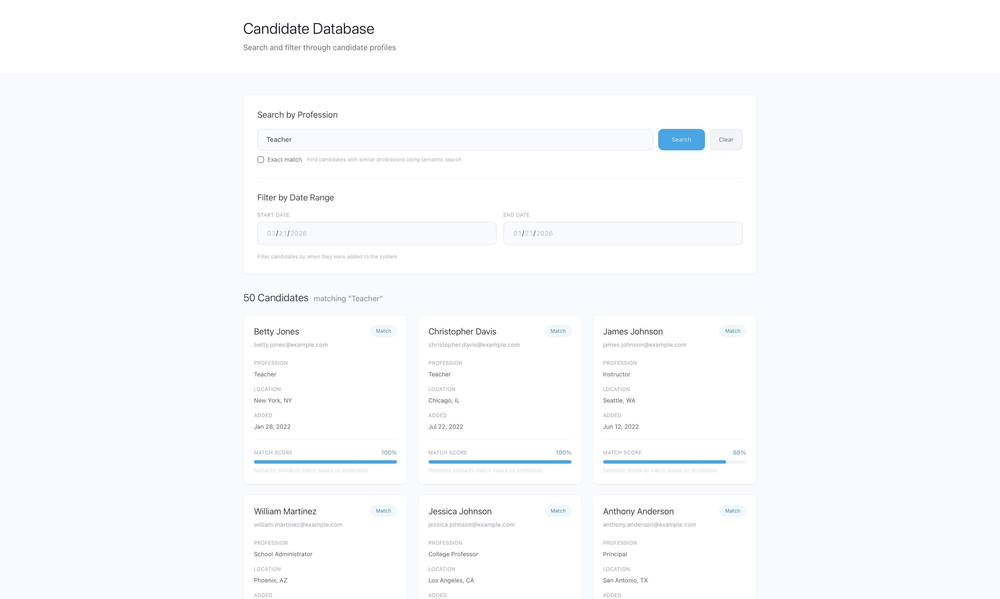
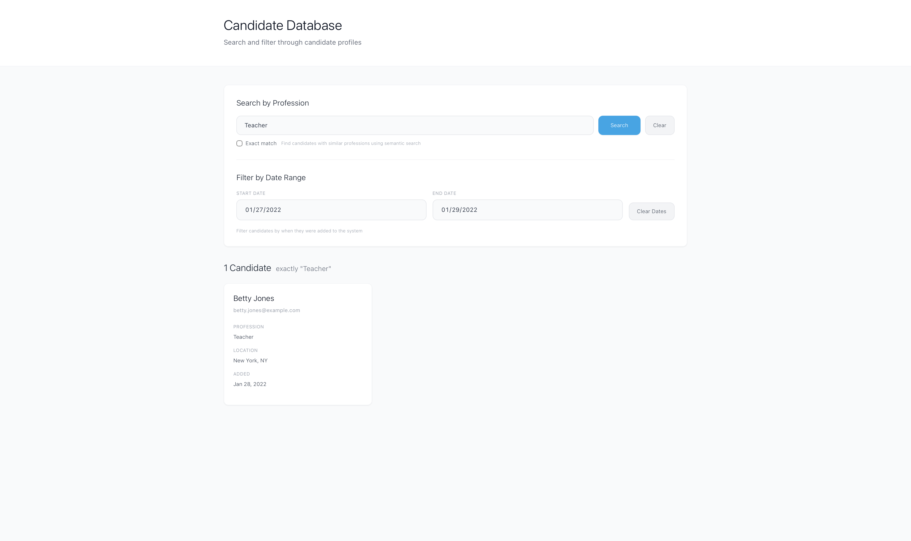
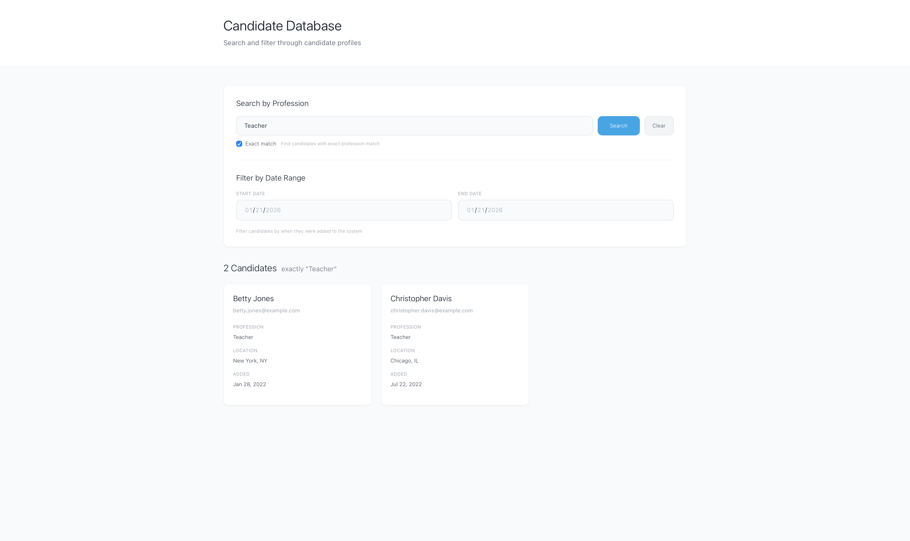

# MagMutual // Candidate Database

A full-stack application for managing and searching candidate profiles with semantic similarity search capabilities.

## Project Overview

This project consists of:
- **Backend API**: FastAPI application serving user data from CSV with semantic search
- **Frontend Client**: React application for browsing and searching candidates

## Project Structure

```
magmutual/
├── api/                    # FastAPI backend
│   ├── __init__.py
│   ├── main.py            # FastAPI app and route definitions
│   ├── csv_reader.py      # CSV reading and parsing utilities
│   ├── vector_search.py   # Vector similarity search for professions
│   ├── data/
│   │   └── users.csv      # Sample user data CSV
│   └── README.md          # API documentation
├── client/                 # React frontend
│   ├── src/
│   │   ├── components/    # React components
│   │   ├── pages/         # Page components
│   │   ├── services/      # API service layer
│   │   └── ...
│   └── README.md          # Frontend documentation
├── tests/                  # Test suite
│   ├── test_endpoints.py  # API endpoint tests
│   └── test_csv_reader.py # CSV reading tests
├── docs/                   # Documentation assets
│   └── images/            # Screenshots and images
├── requirements.txt        # Python dependencies
└── README.md              # This file
```

## Quick Start

### Prerequisites

- Python 3.10.0
- Node.js and npm (for frontend)
- pyenv (for Python virtual environment management)

### Backend Setup

1. Navigate to the project root directory
2. Activate your Python environment:
   ```bash
   pyenv activate magmutual
   ```

3. Install Python dependencies:
   ```bash
   pip install -r requirements.txt
   ```

4. Start the API server:
   ```bash
   python -m uvicorn api.main:app --reload
   ```

   The API will be available at `http://localhost:8000`

   See [api/README.md](api/README.md) for detailed API documentation.

### Frontend Setup

1. Navigate to the client directory:
   ```bash
   cd client
   ```

2. Install dependencies:
   ```bash
   npm install
   ```

3. Start the development server:
   ```bash
   npm start
   ```

   The frontend will be available at `http://localhost:3000`

   See [client/README.md](client/README.md) for detailed frontend documentation.

## Features

### Backend (API)
- RESTful API for user data queries
- Semantic similarity search for professions
- Date range and profession filtering
- CSV-based data storage (no database required)
- Vector embeddings for intelligent profession matching

### Frontend (React)
- Candidate list view with search and filters
- Individual candidate detail pages
- Semantic profession search with similarity visualization
- Date range filtering
- Exact match toggle for profession search
- Modern, responsive UI

## Screenshots

### Semantic Search

*Search for candidates using semantic similarity - finds related professions automatically*

### Semantic Search with Date Filters

*Combine semantic search with date range filtering for precise results*

### Exact Match Search

*Toggle exact match mode for precise profession matching*

### Candidate Profile

*View detailed candidate information with full profile data*

## Running Tests

Run all tests from the project root:

```bash
pytest
```

Run with verbose output:

```bash
pytest -v
```

Run specific test files:

```bash
pytest tests/test_endpoints.py
pytest tests/test_csv_reader.py
```

## Development

### Backend Development

- API documentation: See [api/README.md](api/README.md)
- API docs (when server is running): `http://localhost:8000/docs`
- Main entry point: `api/main.py`

### Frontend Development

- Frontend documentation: See [client/README.md](client/README.md)
- Main entry point: `client/src/index.js`
- Uses Create React App with Tailwind CSS

## Technology Stack

### Backend
- **FastAPI**: Modern Python web framework
- **sentence-transformers**: Semantic search embeddings
- **scipy**: Cosine similarity calculations
- **Uvicorn**: ASGI server

### Frontend
- **React**: UI library
- **React Router**: Client-side routing
- **Axios**: HTTP client
- **Tailwind CSS**: Utility-first CSS framework

## License

This project is for demonstration purposes.
